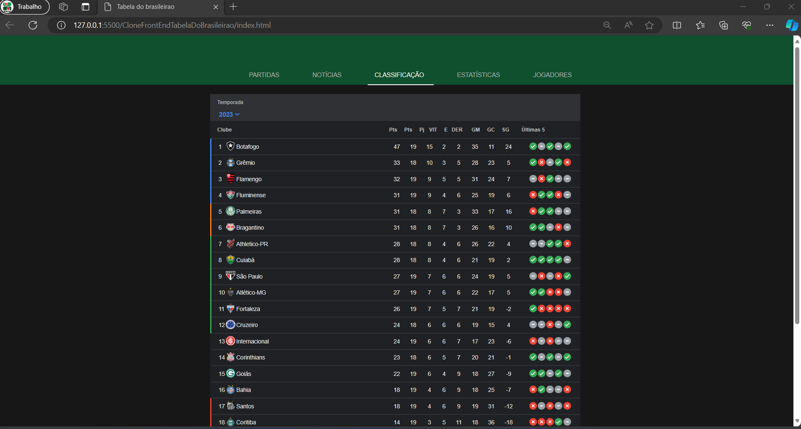
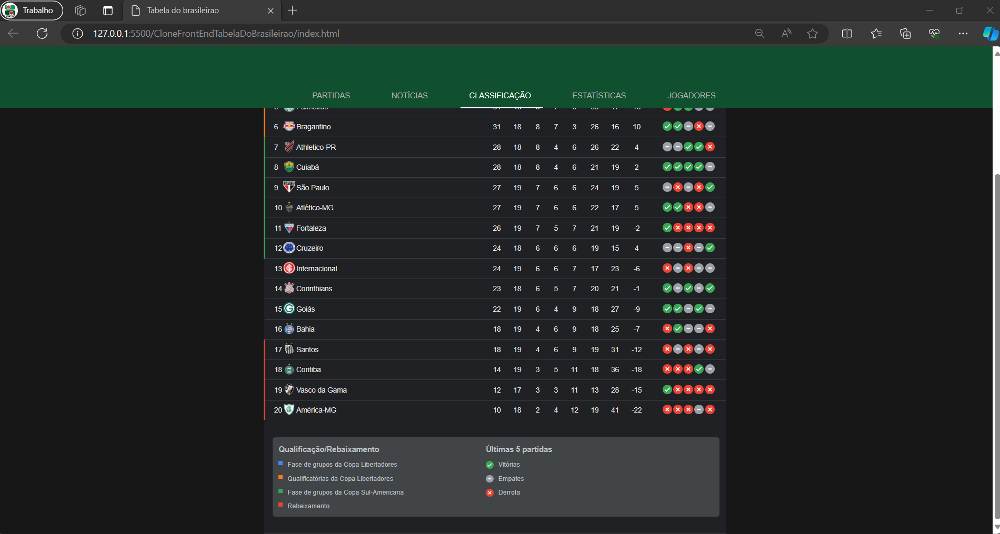

<h1> CloneFrontEndTabelaDoBrasileirao ⚽</h1>

 Neste projeto recriei a tabela de classificação do Campeonato Brasileiro utilizando Html e Css, com objetivo de aprimorar minhas habilidades na criação de tabelas.

Segue abaixo algumas imagens do projeto final e do site original.

<h3>Imagens do Projeto Final</h3>

  
  

<h3>Imagens do Site Oficial</h3>

  
  

